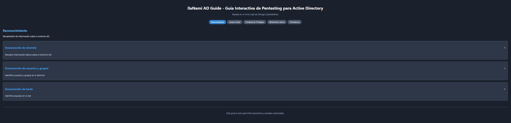

# IlaNami AD Guide - Guía Interactiva de Pentesting para Active Directory

**Ver la aplicación desplegada:** [**https://ilanami.github.io/llaNami-ADGuide/**](https://ilanami.github.io/llaNami-ADGuide/)

## Descripción

IlaNami AD Guide es una aplicación web interactiva diseñada para servir como guía de referencia rápida y estructurada durante pruebas de penetración (pentesting) en entornos de **Active Directory (AD)**. Organiza una amplia variedad de técnicas, herramientas y comandos según las fases típicas de un ataque, facilitando el aprendizaje y la consulta ágil.

Este proyecto se basa en la metodología y la información recopilada en el excelente mind map sobre pentesting de AD de **Orange Cyberdefense**.

## Características Principales

* **Navegación por Fases:** Explora técnicas organizadas por fases: Reconocimiento, Acceso Inicial, Escalada de Privilegios, Movimiento Lateral y Dominación de Dominio.
* **Técnicas Detalladas:** Cada técnica se presenta en un formato de acordeón expandible que incluye:
    * Descripción clara de la técnica.
    * Herramientas comúnmente utilizadas para ejecutarla.
    * Comandos de ejemplo específicos para cada herramienta.
    * Enlaces a recursos externos (como MITRE ATT&CK) para profundizar.
* **Información de Herramientas:** Haz clic en el nombre de cualquier herramienta mencionada para abrir una ventana modal con:
    * Descripción de la herramienta.
    * Enlace a su sitio web o repositorio oficial.
    * Lista de comandos comunes.
    * Notas adicionales relevantes.
* **Interactividad:** Diseño de acordeón para expandir y contraer técnicas fácilmente.
* **Interfaz Limpia:** Desarrollada con React para una experiencia de usuario fluida.

## Uso

1.  Accede a la [aplicación desplegada](https://ilanami.github.io/llaNami-ADGuide/).
2.  Selecciona una fase de ataque usando los botones superiores.
3.  Haz clic en el título de una técnica para expandir/contraer sus detalles.
4.  Dentro de una técnica expandida, haz clic en el nombre de una herramienta (etiqueta) para ver información detallada sobre ella.
5.  Usa los botones "Copiar" junto a los comandos en la ventana modal de herramientas para copiarlos fácilmente.

## Despliegue

El despliegue a GitHub Pages se realiza automáticamente mediante GitHub Actions al hacer push a la rama `main`.

## Descargo de Responsabilidad

Esta herramienta y la información contenida en ella se proporcionan únicamente con **fines educativos** y para ser utilizadas en **entornos controlados y con autorización explícita**. El uso indebido de estas técnicas o herramientas en sistemas no autorizados es ilegal y responsabilidad exclusiva del usuario.

---

## Available Scripts (Para Desarrollo Local)

Este proyecto fue iniciado con [Create React App](https://github.com/facebook/create-react-app). En el directorio del proyecto, puedes ejecutar:

### `npm start`

Ejecuta la aplicación en modo de desarrollo.\
Abre [http://localhost:3000](http://localhost:3000) para verla en tu navegador.

La página se recargará cuando hagas cambios.\
También puedes ver errores de lint en la consola.

### `npm test`

Lanza el corredor de pruebas en modo interactivo.\
Consulta la sección sobre [running tests](https://facebook.github.io/create-react-app/docs/running-tests) para más información.

### `npm run build`

Construye la aplicación para producción en la carpeta `build`.\
Empaqueta React correctamente en modo producción y optimiza la build para el mejor rendimiento.

La build es minificada y los nombres de archivo incluyen hashes.\
¡Tu aplicación está lista para ser desplegada! (Aunque el despliegue real lo hace GitHub Actions).

### `npm run eject`

**Nota: esta es una operación de un solo sentido. ¡Una vez que haces `eject`, no puedes volver atrás!**

Si no estás satisfecho con las herramientas de build y las opciones de configuración, puedes hacer `eject` en cualquier momento. Este comando eliminará la única dependencia de build de tu proyecto.

En su lugar, copiará todos los archivos de configuración y las dependencias transitivas (webpack, Babel, ESLint, etc.) directamente en tu proyecto para que tengas control total sobre ellos. Todos los comandos excepto `eject` seguirán funcionando, pero apuntarán a los scripts copiados para que puedas modificarlos. En este punto, estás por tu cuenta.

No tienes que usar `eject` nunca. El conjunto de características curadas es adecuado para despliegues pequeños y medianos, y no deberías sentirte obligado a usar esta función. Sin embargo, entendemos que esta herramienta no sería útil si no pudieras personalizarla cuando estés listo para ello.

---
*Basado en el mind map de Orange Cyberdefense.*

